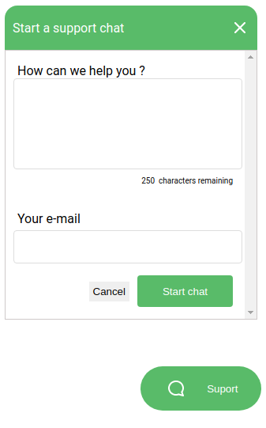
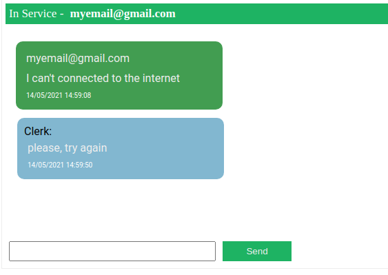

<h1 align="center"> 
  
  
</h1>

## About
- A web application using socket.io that users will be able to chat with administrators.
- Clients are responsible for sending messages using their emails
- Admins can choose the clients to be served by their email 

## What is inside?

This project uses this stuff:

- [TypeScript](https://www.typescriptlang.org/)
- [TypeORM](https://typeorm.io/)
- [Socket.IO](https://socket.io/)

## Getting Started

First, run the development server:

```bash
npm run dev

# or

yarn dev
```

Open Client [http://localhost:3333/pages/client](http://localhost:3333/pages/client) with your browser to see the result.

Open Admin [http://localhost:3333/pages/admin](http://localhost:3333/pages/admin) with your browser to see the result.

## Learn More

To learn more about Next.js, take a look at the following resources:

- [Socket.IO with Node.js](https://socket.io/docs/v4/server-api/) - learn how to use socket.io in server side.